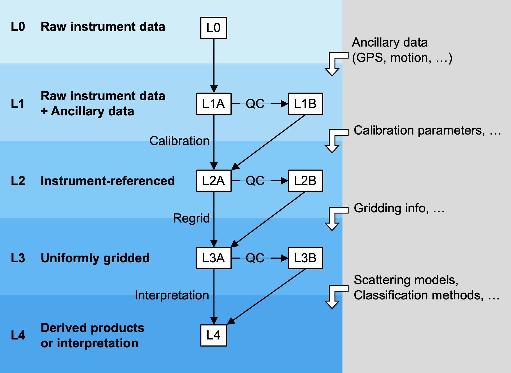

# Echosounder Data Processing Levels

"Data processing levels" are categorization of the continuum of data at different stages of processing, from raw sensor readings to derived, georeferenced data products that are ready for analysis or interpretation.

This repository contains a set of proposed specifications of data processing levels for water column sonar (echosounder) data we (the [Echopype](https://echopype.readthedocs.io) team) have put together. We have added the proposed data processing levels as prototypes into the output data of different functions.

Below is a summary figure of the proposed processing level definitions. **See the full draft definitions [here](http://echolevels.readthedocs.io/).**

We welcome [inputs or questions via GitHub issues](https://github.com/OSOceanAcoustics/echolevels/issues/new)!

