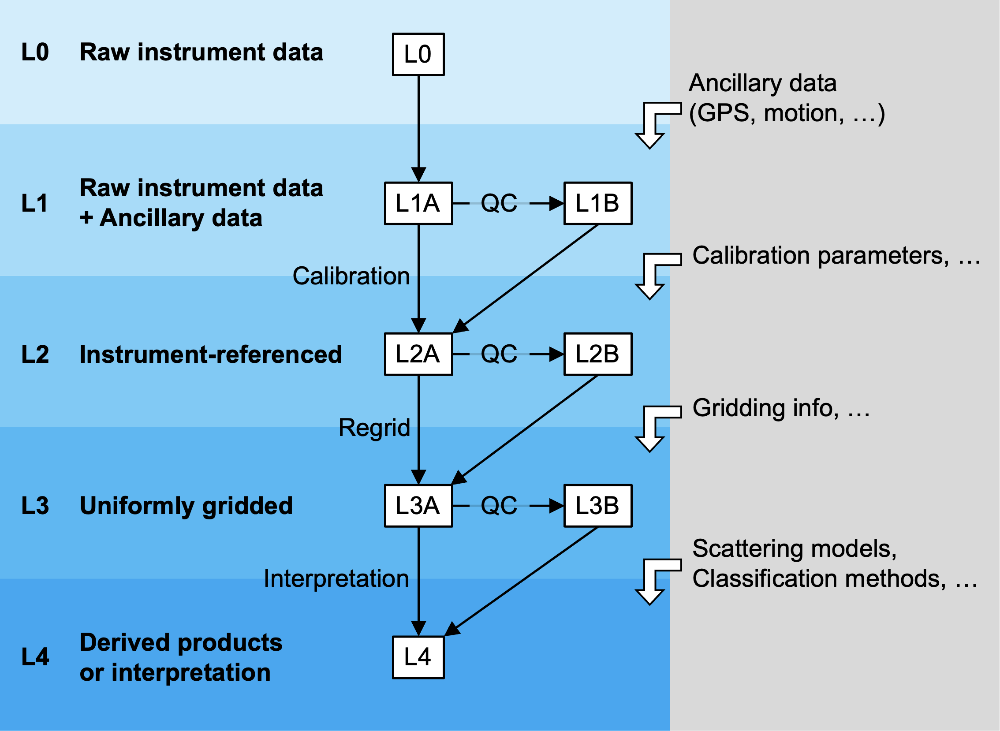

# Proposed processing levels

Our proposed definitions of echosounder data processing levels are strongly guided by the most widely used NASA EOS scheme {cite}`weaver_processing_2014,nasa_data_2021` ([more info](./review.md)) and also informed by the two [existing implementations](levels-existing) for echosounder data. We follow the NASA EOS numbering of levels from L0 to L4, and adopt sub-level designations "A" and "B" to indicate data before and after **level-specific** quality control or filtering steps, respectively. 

<!-- [2024/04: removed because echosounder data processing can be carried out even if no geolocation data is available] As with all other schemes, except for L0, only data products with geolocation information are assigned a data processing level code. -->

<!-- [2024/04: removed due to redundancy from the first paragraph] These decisions are made based on [our review](./review.md) of existing data processing level categorizations in the environmental monitoring community and the limited implementations on echosounder data, which highlights both broad consistencies in the progression of processing levels and the criteria used to distinguish between levels, as well as the considerable differences that reflect specific features of the observing system or goals of the group implementing the data processing level scheme. -->

<!-- [2023/10: keeping below as comments for now to keep text focused and avoid repetition] For example, L1 sometimes accommodates data products with calibration already applied. Geolocation is sometimes assigned at every data point at L1 rather than L2. Quality control steps, such as those involving distortions or noise, occur in both L1 and L2. Sub-level designations, when used, have poorly standardized meanings. -->

Below are our proposed data processing levels for echosounder data.
<!-- [2023/10: remove for now and add back once filtering and classification levels are determined] , with reference to the associated implementation in the software [echopype](https://echopype.readthedocs.io) when appropriate. -->

## Level 0 (L0)

**Description:** Raw data in manufacturer instrument format. The data files are typically binary. The associated metadata may be found within the raw instrument files or in external files collected by other instruments.

**Rationale:** The use of L0 data processing level for raw data files in the original manufacturer format is the most widespread practice in both satellite remote sensing programs {cite}`weaver_processing_2014,mittaz_applying_2019,nasa_data_2021`  and existing echosounder data implementations {cite}`haris_imos_2018,heaney_adeon_2020`.

## Level 1 (L1)

**Description:** Raw data packaged with ancillary information and converted and standardized to common data formats based on an open convention. Use of the ICES (International Council for the Exploration of the Sea) SONAR-netcDF4 convention {cite}`macaulay_pena_2018` is strongly recommended. While individual echosounder pings may or may not be georeferenced, latitude and longitude coordinates are often included in the data file or exist as external files and can be interpolated to each ping based on the timestamps.

L1 data is further categorized into two sub-levels:

- **L1A:** Raw L0 data converted to a standardized, open format 
The data include other ancillary information extracted from echosounder-generated L0 data or other external sources, and may include environmental information such as temperature, salinity and pressure. <!-- with geographic coordinates (latitude & longitude) included. -->
- **L1B:** L1A data with quality-control or filtering steps applied, such as time-coordinate corrections that enforce strictly increasing, non-duplicate timestamps.

L1 data may be distributed in the following two forms:

- Sets of individual files converted from raw L0 data created by the echosounder instrument, or
- Larger granules of compiled converted files corresponding to logical deployment or data collection intervals while the echosounder pings continuously. For a research cruise, each granule may represent well defined transects. For a mooring, this may be a daily granule if the sensor is turned off on a daily cycle. 

**Rationale:** We designate L1 as the data processing level that contains raw data together with metadata and ancillary data converted to an accessible data format following the SONAR-netCDF4 convention. This approach follows the CEOS {cite}`ceos_interoperability_2008` definition for L1 data ("Unpacked, reformatted level 0 data, with all supplemental information to be used in subsequent processing appended"). It is also consistent with the NASA EOS L1A definition and NASA EOS' use of standardized, metadata-rich formats for data products.

Existing implementations by ADEON and IMOS have focused their efforts on processed data products, starting with Sv and similar variables. While ADEON and IMOS use different processing levels to designate this starting point (L1 and L2, respectively), both lack a more user-accessible intermediate level between the original raw data files generated by the instruments (L0) and the processed data products.

<!-- The SONAR-netCDF4 convention (particularly version 1) is motivated by the need for improved accessibility to raw data as well as the development of data repositories such as the NOAA Water Column Sonar Data Archive {cite}`wall_2016`. -->

## Level 2 (L2)

**Description:** Calibrated acoustic quantities, such as volume backscattering strength (Sv), at raw data resolution.
<!-- , with spatial coordinates (latitude, longitude and depth) interpolated to all pings.  -->
<!-- The data may include noise removal or other filtering. -->

- **L2A:** Acoustic quantities calibrated from L1 data. The data may incorporate additional information also derived from L1 data, such as split beam angle.
<!-- with interpolated latitude, longitude and depth coordinates -->
<!-- Masks derived from these products, such as seafloor bottom mask, will also be designated as L2A products. -->
- **L2B:** L2A data with quality-control or filtering steps applied, such various noise filters and removal of echoes from seafloor or sea surface.

**Rationale:**  L2 products in the other environmental monitoring data processing level schemes focuses on "retrieval" of geophysical or biophysical variables from radiometric variables, at the same resolution as the input L1 data {cite}`ceos_interoperability_2008,mittaz_applying_2019,nasa_data_2021`. For the NASA MODIS sensor, radiometric calibration parameters from L1 are applied to derive L2 ocean products such as the sea surface temperature and chlorophyll-a pigment concentration {cite}`parkinson_eos_2000`.

We follow the same approach as the existing implementations by ADEON and IMOS, where a new level is designated for calibrated acoustic quantities following raw data conversion and standarization. The proposed L2A data corresponds to ADEON L1 and IMOS L2 products. Additional processing involving noise and other data filtering without resolution change are categorized as L2B, which corresponds to ADEON L2 processing steps and IMOS L2 products.

## Level 3 (L3)

**Description:** Calibrated acoustic quantities regridded or aggregated to a common grid across echosounder channels. Example L3 products include:

- Sv resampled to a common, high-resolution grid across channels
- Mean volume backscattering strength (MVBS)
<!-- [not sure why this is in L4] - Masks applied to Sv based on different scattering source classification methods, such as frequency differencing across two channels -->

L3 data is further categorized into two sub-levels:

- **L3A:** Calibrated L2 data regridded or aggregated to a common grid across echosounder channels
- **L3B:** L3A data with quality-control or filtering steps applied, such as additional noise filtering.

**Rationale:** L3 products are commonly defined as data spatially and/or temporally re-sampled (regridded) on a regular space-time grid {cite}`ceos_interoperability_2008,mittaz_applying_2019,nasa_data_2021`. They are often referred to as gridded data. Following these conventional definition, We designate L3 to include the outcome of resampling or binning L2 data onto a common grid, often at a resolution coarser than the original data.

Note that ADEON incorporates this regular gridding in the L2 product. IMOS also includes gridded variables in its L2 product. However, IMOS L2 (derived data products) is a broad designation encompassing products that have undergone a wide range of processing steps. 

## Level 4 (L4)

**Description:** Acoustically derived biological and environmental estimates, quantities, or indices, involving further processing of L3 data that may include data reduction or incorporation of external sources of data. Examples of L4 products include:

- Nautical area backscattering coefficients (NASC), potentially partitioned into different sources of scattering
- Classification outcome, such as taxon or species-level data labels
- Estimated biomass, combined or partitioned into different taxonomic groups
- Summary statistics of echogram features, such as center of mass, dispersion, etc.

**Rationale:** L4 data are typically defined as highly processed products resulting from models or analysis of lower-level data. For satellite products, they are often complete, continuous fields without gaps and may involve data from different sensors {cite}`mittaz_applying_2019`. For example, ocean primary production from the MODIS sensor is a L4 product {cite}`parkinson_eos_2000`.

Following these practices, we designate L4 data to be highly processed products and metrics that depend on L3 products, particularly ones that are partitioned by taxonomic groupings derived either from external information or directly from analysis of acoustic data features.

For existing implementations: ADEON processing levels beyond L2 are specified contains gridded products including NASC, but are not clearly described. IMOS products are all designated as L2 and include derived variables ("metrics") that are the result of integrating Sv along a depth interval such as the 20-200 m "epipelagic" zone. 
